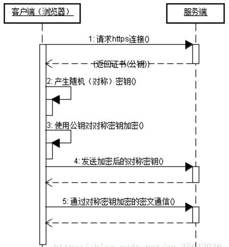

# 图解http

## Http各版本

### 1.0

* 短连接，每次与服务器交互，都需要新开一个连接。


### 1.1

- 长连接（在头部会标注，所以传输数据会变大）

  > Connect: keep-alive

- 支持管线化，但默认关闭，多个请求使用一个TCP，可能会阻塞

  > 每一个请求都是有顺序的，客户端按顺序处理响应（即使服务端返回的顺序可能不是按顺序返回的）
  >
  > 当请求超过限制之后，超过限制的请求会阻塞

- 断点续连


### 2.0

- 长连接，多路复用，一次可以有多个请求

  > 可以不按照顺序处理请求响应，收到响应就进行处理
  >
  > 允许同时通过单一的 HTTP/2 连接发起多重的请求-响应消息。帧在连接上的传输没有数量限制

- 二进制分帧层

  > 将1.1的文本报文封装进行分帧，成二进制，传输二进制
  >
  > 首部封装成HEADER Frame，主体被封装成DATA Frame

- 头部压缩（资源请求进行压缩，传输数据会变小, 省流量）

  > 对头部请求进行压缩，可以将请求的内容封装在一起进行传输，省去了多次请求重复的头部信息

- 服务器推送

  > 服务器对一个请求可以发送多个响应


请求一个包含529张图片的页面，三个版本的对比


HTTP/3`版本：

- `HTTP1.x`和`HTTP/2`底层都是TCP，而`HTTP/3`底层是UDP。使用`HTTP/3`能够减少**RTT「往返时延」**（TCP三次握手，TLS握手）

## 请求

### 请求方式

* Get

  > 用来访问已经被URI标识的资源

* Post

  > 用来传输实体的主体

* Put

  > 用于传输文件，将文件内容放在请求主体中，保存到请求的URI路径下

* Head

  > 获取报文首部，类似Get，但不返回报文主体。用于确认URI的有效性及资源更新日期等

* Delete

  > 按照请求的URI删除资源

* Options

  > 询问URI资源支持的请求方式

* Trace

  > 追踪路径，不常用

* Connect

  > 要求使用隧道协议连接代理
  >
  > CONNECT 方法要求在与代理服务器通信时建立隧道，实现用隧道协议进行 TCP 通
  > 信。主要使用 SSL（Secure Sockets Layer，安全套接层）和 TLS（Transport Layer
  > Security，传输层安全）协议把通信内容加 密后经网络隧道传输。

## 响应

## 状态管理

> 无状态协议

* Cookie

  使用Cookie技术保存记录，保存在客户端磁盘上，在请求和响应报文首部字段中传递

  > Cookie: sid=1342077140226724

* Session

  Session保存在服务器内存中，每一个连接都有唯一的id，可以根据Cookie中记录Sessionid确认连接的是哪一个

## 传输效率

* 主体内容压缩

* 分块传输

  > 可以实现加载部分先看的功能

## 状态码

* 1XX

  > 信息类状态码，接收的请求正在处理

* 2XX

  > 成功状态码，请求正常处理（<font color="red">3个常用</font>）
  >
  > > 200 OK 成功返回
  > >
  > > 204 No Content 成功处理，但无资源可返回，页面接收到响应后不更新
  > >
  > > 206 Partial Content 成功处理了范围请求，返回内容包含请求报文中由Content-Range指定的内容

* 3XX

  > 重定向状态码，需要进行附加操作以完成请求（<font color="red">5个常用</font>）
  >
  > > 301 Moved Permanently 永久性重定向，
  > >
  > > ```java
  > > 浏览器访问 bt.byr.cn
  > > 响应301，location定位到https://bt.byr.cn/
  > > ```
  > >
  > > 302 Found 临时重定向，需要转到location定位的uri
  > >
  > > ```java
  > > 浏览器访问https://bt.byr.cn/
  > > 响应302，location定位到https://bt.byr.cn/login.php
  > > ```
  > >
  > > 303 See Other 临时重定向，要求客户端使用Get方式请求
  > >
  > > 304 Not Modified 资源已找到，但未符合条件请求
  > >
  > > 	* 该状态码表示客户端发送附带条件的请求 2 时，服务器端允许请求访问资源，但未满足条件的情况。304 状态码返回时，不包含任何响应的主体部分。304 虽然被划分在 3XX 类别中，但是和重定向没有关系。
  > > 	* 附带条件的请求是指采用 GET 方法的请求报文中包含 If-Match，If-ModifiedSince，If-None-Match，If-Range，If-Unmodified-Since 中任一首部。
  > >
  > > ```java
  > > 浏览器访问 https://manga.bilibili.com/
  > > 会有一部分304
  > > ```
  > >
  > > 307 Temporary Redirect 临时重定向。该状态码与 302 Found 有着相同的含义。

* 4XX

  > 客户端错误状态码，服务端无法处理请求（<font color="red">4个常用</font>）
  >
  > > 400 Bad Request 请求报文存在语法错误
  > >
  > > 401 Unauthorized 表示需要进行用户认证
  > >
  > > 403 Forbidden 表示不允许访问该资源
  > >
  > > 404 Not Found 表示服务器上没有该资源

* 5XX

  > 服务器错误状态码，服务器端处理请求出错（<font color="red">2个常用</font>）
  >
  > > 500 Internal Server Error 服务器端处理请求时发生了错误
  > >
  > > 503 Service Unavailable 服务器正忙

## 通信数据转发程序

* 代理

  > 代理用于转发请求和响应
  >
  > 缓存代理：对资源进行缓存，多次访问同一资源时，可从缓存中返回请求报文
  >
  > 透明代理：对请求或者响应报文不做任何加工的代理

* 网关

  > 而网关能使通信线路上的服务器提供非 HTTP 协议服务。
  >
  > 

* 隧道

  > 隧道可按要求建立起一条与其他服务器的通信线路，届时使用 SSL 等加密手段进行通信。隧道的目的是确保客户端能与服务器进行安全的通信。
  >
  > 

## HTTP首部

* HTTP报文结构

  > 请求/响应行（请求方法 请求URI http版本/http版本 状态码 状态码描述）
  >
  > 首部字段
  >
  > ​	请求/响应字段
  >
  > ​	通用字段
  >
  > ​	实体首部字段
  >
  > 空行
  >
  > 请求/响应主体

* 首部字段

  * 首部字段结构

    > 首部字段名：Key1=Value1, Key2=Value2
    >
    > 例：Content-Type: text/html
    >
    > 例：Keep-Alive: timeout=15, max=100

## HTTPS

> 采用SSL网络安全技术，HTTP+TCP—>HTTP+SSL+TCP

###  HTTPS与HTTP的区别

- HTTPS需要申请CA认证，需要费用
- HTTPS数据进行加密处理，HTTP采用明文传送
- 默认端口不同，HTTPS是443，HTTP是80
- HTTPS采用SSL/TLS协议构建可加密传输、身份认证的网络协议，安全。HTTP是简单连接无状态

###  HTTPS建立连接请求的步骤

- 客户端请求连接服务器
- 服务器返回CA认证证书
- 客户端产生对称密钥
- 客户端使用服务器的公钥对对称密钥加密
- 客户端发发送加密后的对称密钥给服务器
- 服务器使用私钥解密得到对称密钥
- 客户端与服务端使用对称密钥对请求和响应报文进行加密解密传输数据

