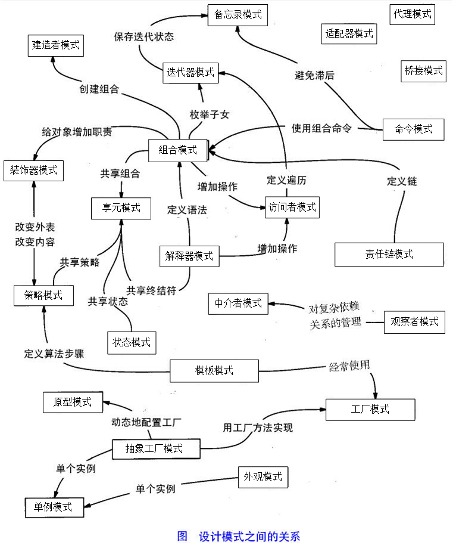

# 设计模式
## 一、简介
### 1.1 分类
* 创建者模式
    * 工厂模式
    * 抽象工厂模式
    * 单例模式
    * 建造者模式
    * 原型模式
* 结构型模式
    * 适配器模式
    * 桥接模式
    * 过滤器模式
    * 组合模式
    * 装饰器模式
    * 外观模式
    * 享元模式
    * 代理模式
* 行为型模式
    * 责任链模式
    * 命令模式
    * 解释器模式
    * 迭代器模式
    * 中介者模式
    * 备忘录模式
    * 观察者模式
    * 状态模式
    * 空对象模式
    * 策略模式
    * 模板模式
    * 访问者模式
* J2EE模式
    * MVC模式
    * 业务代表模式
    * 组合实体模式
    * 数据访问对象模式
    * 前端控制器模式
    * 拦截过滤器模式
    * 服务定位器模式
    * 创数对象模式
### 1.2  设计模式关系图



### 1.3 设计模式六大原则
1、开闭原则（Open Close Principle）

开闭原则的意思是：对扩展开放，对修改关闭。在程序需要进行拓展的时候，不能去修改原有的代码，实现一个热插拔的效果。简言之，是为了使程序的扩展性好，易于维护和升级。想要达到这样的效果，我们需要使用接口和抽象类，后面的具体设计中我们会提到这点。

2、里氏代换原则（Liskov Substitution Principle）

里氏代换原则是面向对象设计的基本原则之一。 里氏代换原则中说，任何基类可以出现的地方，子类一定可以出现。LSP 是继承复用的基石，只有当派生类可以替换掉基类，且软件单位的功能不受到影响时，基类才能真正被复用，而派生类也能够在基类的基础上增加新的行为。里氏代换原则是对开闭原则的补充。实现开闭原则的关键步骤就是抽象化，而基类与子类的继承关系就是抽象化的具体实现，所以里氏代换原则是对实现抽象化的具体步骤的规范。

3、依赖倒转原则（Dependence Inversion Principle）

这个原则是开闭原则的基础，具体内容：针对接口编程，依赖于抽象而不依赖于具体。

4、接口隔离原则（Interface Segregation Principle）

这个原则的意思是：使用多个隔离的接口，比使用单个接口要好。它还有另外一个意思是：降低类之间的耦合度。由此可见，其实设计模式就是从大型软件架构出发、便于升级和维护的软件设计思想，它强调降低依赖，降低耦合。

5、迪米特法则，又称最少知道原则（Demeter Principle）

最少知道原则是指：一个实体应当尽量少地与其他实体之间发生相互作用，使得系统功能模块相对独立。

6、合成复用原则（Composite Reuse Principle）

合成复用原则是指：尽量使用合成/聚合的方式，而不是使用继承。
##  二、23种模式详解
### 2.1 工厂模式
#### 简介：
* 不关注具体创建对象的过程，由工厂根据信息创建对象
* 一个工厂类根据传入的参量决定创建出那一种产品类的实例。
#### 示例：
1. 接口
    * Shape 接口
        * Cycle implements Shape
        * Square implements Shape
2. 接口工厂
   
    ```java
        public class ShapeFactory{
            public Shape create("String ShapeClassName"){
                if(shapeType == null){
                    return null;
                }        
                if(shapeType.equalsIgnoreCase("Cycle")){
                    return new Circle();
                } else if(shapeType.equalsIgnoreCase("Rectangle")){
                return new Rectangle();
                } else if(shapeType.equalsIgnoreCase("Square")){
                return new Square();
                }
                return null;
            }
        }
    ```
#### 使用：
* 给接口工厂传递想要的实现类型，由工厂的方法创建具体对象。
    ```java
    public class FactoryPatternDemo {

       public static void main(String[] args) {
          ShapeFactory shapeFactory = new ShapeFactory();

          //获取 Circle 的对象，并调用它的 draw 方法
          Shape shape1 = shapeFactory.getShape("CIRCLE");

          //调用 Circle 的 draw 方法
          shape1.draw();

          //获取 Rectangle 的对象，并调用它的 draw 方法
          Shape shape2 = shapeFactory.getShape("RECTANGLE");

          //调用 Rectangle 的 draw 方法
          shape2.draw();

          //获取 Square 的对象，并调用它的 draw 方法
          Shape shape3 = shapeFactory.getShape("SQUARE");

          //调用 Square 的 draw 方法
          shape3.draw();
       }
    }
    ```
### 2.2 抽象工厂模式
#### 简介：
* 为普通工厂打包成超级工厂抽象类，由超级工厂抽象类的子类实现普通工厂的创建具体实例的任务
#### 示例：
1. 接口
    * Shape 接口
        * Cycle implements Shape
        * Square implements Shape
    * Color 接口
        * Red implements Color
        * Blue implements Color

2. 超级工厂抽象类
   
    ```java
        public abstract class AbstractFactory{
            public abstract Color getColor(String color);
            public abstract Shape getShape(String shape);
        }
    ```
3. 超级工厂抽象类子类
   
    ```java
        public class ShapeFactory extends AbstractFactory {

           @Override
           public Shape getShape(String shapeType){
              if(shapeType == null){
                 return null;
              }        
              if(shapeType.equalsIgnoreCase("CIRCLE")){
                 return new Circle();
              } else if(shapeType.equalsIgnoreCase("SQUARE")){
                 return new Square();
              }
              return null;
           }

           @Override
           public Color getColor(String color) {
              return null;
           }
        }
        
        
        
        public class ColorFactory extends AbstractFactory {
    
           @Override
           public Shape getShape(String shapeType){
              return null;
           }

           @Override
           public Color getColor(String color) {
              if(color == null){
                 return null;
              }        
              if(color.equalsIgnoreCase("RED")){
                 return new Red();
              } else if(color.equalsIgnoreCase("BLUE")){
                 return new Blue();
              }
              return null;
           }
        }
    ```
5. 工厂类的工厂类
   
    ```java
        public class FactoryProducer {
           public static AbstractFactory getFactory(String choice){
              if(choice.equalsIgnoreCase("SHAPE")){
                 return new ShapeFactory();
              } else if(choice.equalsIgnoreCase("COLOR")){
                 return new ColorFactory();
              }
              return null;
           }
        }
    ```
#### 使用：

```java
public class AbstractFactoryPatternDemo {
    public static void main(String[] args) {

        AbstractFactory shapeFactory = FactoryProducer.getFactory("SHAPE");
        Shape shape1 = shapeFactory.getShape("CIRCLE");
        shape1.draw();

        AbstractFactory colorFactory = FactoryProducer.getFactory("COLOR");
        Color color1 = colorFactory.getColor("RED");
        color1.fill();
    }
}
```
### 2.3 单例模式
#### 简介：
* 单例类只能有一个实例
* 所有对象指向同一个实例内存
* 单例类必须自己创建自己的唯一实例
#### 示例：
* 单例类
    * 懒汉式创建法
        1. 非线程安全·
    
        ```java
        public class Singleton {  
            private static Singleton instance;  
            private Singleton (){}  

            public static Singleton getInstance() {  
                if (instance == null) {  
                    instance = new Singleton();  
                }  
                return instance;  
            }  
        }
        ```
        2. 线程安全
        1、 synchronized关键字锁法
           
            ```java
            public class Singleton {  
                private static Singleton instance;  
     private Singleton (){}  
           
                public static synchronized Singleton getInstance() {  
                    if (instance == null) {  
                        instance = new Singleton();  
                    }  
                    return instance;  
                }  
            }
            ```
     2、 双检锁/双重校验锁法
           
            ```java
            public class Singleton {  
                private volatile static Singleton singleton;  
                private Singleton (){}  
                public static Singleton getSingleton() {  
                if (singleton == null) {  
                    synchronized (Singleton.class) {  
                        if (singleton == null) {  
                            singleton = new Singleton();  
                        }  
                    }  
                }  
                return singleton;  
                }  
            }
            ```
    * 饿汉式创建法(推荐)
    
        ```java
        public class Singleton {  
            private static Singleton instance = new Singleton();  
            private Singleton (){}  
            public static Singleton getInstance() {  
                return instance;  
            }  
        }
        ```
    
* 登记式/静态内部类
    
        ```java
        public class Singleton {  
            private static class SingletonHolder {  
            	private static final Singleton INSTANCE = new Singleton();  
            }  
            private Singleton (){}  
            public static final Singleton getInstance() {  
                return SingletonHolder.INSTANCE;  
            }  
        }
        ```
    * 枚举
        ```java
        public enum Singleton {  
            INSTANCE;  
            public void whateverMethod() {  
            }  
        }
        ```
#### 使用
```
Singleton singleton = Singleton.getInstance();
```
### 2.4 建造者模式
#### 简介：
* 利用Builder将多个接口的具体实现类进行组合
#### 示例：
* Food接口
    * Meat implements Food
    * Vegetable implements Food
* Drink接口
    * Milk implements Drink
    * Tea implements Drink
* 普通类
```java
class Meal{   
    Food food 
    Drink drink
}
```
* 普通类builder
```java
class MealBuilder{  
    Meal getMeal1(){
        return new Meal( Meat，Milk)；
    }   
    Meal getMeal2(){
        return new Meal( Vegetable，Milk)；
    }    
    Meal getMeal3(){
        return new Meal( Vegetable，Tea)；
    }    
}
```

#### 使用：
```java
MealBuilder builder = new MealBuilder() ;
Meal meal = builder.getMeal3();
```
### 2.5 原型模式
#### 简介：
用于创建当前对象的克隆。当直接创建对象的代价比较大时，则采用这种模式。例如，一个对象需要在一个高代价的数据库操作之后被创建。我们可以缓存该对象，在下一个请求时返回它的克隆，在需要的时候更新数据库，以此来减少数据库调用。
#### 示例：
* 接口
    * Shape接口 implements Colonable
    * 重写clone方法
* 实现类
    * Cycle implements Shape
    * Square implemsnts Shape
* 缓存实例
  
```java
javaimport java.util.Hashtable;
 
public class ShapeCache {
    
   private static Hashtable<String, Shape> shapeMap 
      = new Hashtable<String, Shape>();
 
   public static Shape getShape(String shapeId) {
      Shape cachedShape = shapeMap.get(shapeId);
      return (Shape) cachedShape.clone();
   }
 
   // 对每种形状都运行数据库查询，并创建该形状
   // shapeMap.put(shapeKey, shape);
   // 例如，我们手动测试添加三种形状
   public static void loadCache() {
      Circle circle = new Circle();
      circle.setId("1");
      shapeMap.put(circle.getId(),circle);
 
      Square square = new Square();
      square.setId("2");
      shapeMap.put(square.getId(),square);
 
      Rectangle rectangle = new Rectangle();
      rectangle.setId("3");
      shapeMap.put(rectangle.getId(),rectangle);
   }
}
```
#### 使用：
```java
public class PrototypePatternDemo {
   public static void main(String[] args) {
      ShapeCache.loadCache();
 
      Shape clonedShape = (Shape) ShapeCache.getShape("1");
      System.out.println("Shape : " + clonedShape.getType());        
 
      Shape clonedShape2 = (Shape) ShapeCache.getShape("2");
      System.out.println("Shape : " + clonedShape2.getType());        
 
      Shape clonedShape3 = (Shape) ShapeCache.getShape("3");
      System.out.println("Shape : " + clonedShape3.getType());        
   }
}
```
### 2.6 适配器模式
#### 简介：
适配器模式（Adapter Pattern）是作为两个不兼容的接口之间的桥梁。这种类型的设计模式属于结构型模式，它结合了两个独立接口的功能。
这种模式涉及到一个单一的类，该类负责加入独立的或不兼容的接口功能。举个真实的例子，读卡器是作为内存卡和笔记本之间的适配器。您将内存卡插入读卡器，再将读卡器插入笔记本，这样就可以通过笔记本来读取内存卡。我们通过下面的实例来演示适配器模式的使用。其中，音频播放器设备只能播放 mp3 文件，通过使用一个更高级的音频播放器来播放 vlc 和 mp4 文件。

#### 示例：
1. 接口
    * 播放器Player接口，有play方法

    * 视频播放器 VideoPlayer接口
        * Mp4VideoPlayer implements MusicPlayer
        * AviVideoPlayer implements MusicPlayer
2. 适配器
```java
public class VideoPlayerAdapter implements Player {
 
   VideoPlayer videoPlayer;
 
   public VideoPlayerAdapter(String audioType){
      if(audioType.equalsIgnoreCase("Mp4") ){
         videoPlayer = new Mp4VideoPlayer();       
      } else if (audioType.equalsIgnoreCase("Avi")){
         videoPlayer = new AviVideoPlayer();
      }  
   }
 
   @Override
   public void play(String audioType, String fileName) {
      if(audioType.equalsIgnoreCase("Mp4")){
         videoPlayer.playMp4(fileName);
      }else if(audioType.equalsIgnoreCase("Avi")){
         videoPlayer.playAvi(fileName);
      }
   }
}
```

#### 使用：

```java
public class AudioPlayer implements Player {
   VideoPlayer videoPlayer; 
 
   @Override
   public void play(String audioType, String fileName) {    
      //播放 mp3 音乐文件的内置支持
      if(audioType.equalsIgnoreCase("mp3")){
         System.out.println("Playing mp3 file. Name: "+ fileName);         
      } 
      //videoPlayer 提供了播放其他文件格式的支持
      else if(audioType.equalsIgnoreCase("MP4") 
         || audioType.equalsIgnoreCase("avi")){
         videoPlayer = new MediaAdapter(audioType);
         videoPlayer.play(audioType, fileName);
      }
      else{
         System.out.println("Invalid media. "+
            audioType + " format not supported");
      }
   }   
}

    public static void main(String[] args) {
      AudioPlayer audioPlayer = new AudioPlayer();
 
      audioPlayer.play("mp3", "beyond the horizon.mp3");
      audioPlayer.play("mp4", "alone.mp4");
      audioPlayer.play("vlc", "far far away.vlc");
      audioPlayer.play("avi", "mind me.avi");
   }
```

### 2.7 桥接模式
#### 简介：
桥接（Bridge）是用于把抽象化与实现化解耦，使得二者可以独立变化。这种类型的设计模式属于结构型模式，它通过提供抽象化和实现化之间的桥接结构，来实现二者的解耦。这种模式涉及到一个作为桥接的接口，使得实体类的功能独立于接口实现类。这两种类型的类可被结构化改变而互不影响。
#### 示例：
画不同颜色图形，可以定义Shape抽象类，由draw方法，用子类实现，画红圆、红方块、绿圆、绿方块。。。子类太多啦
用桥接方式，draw 可以有颜色和形状的组合，使用桥接方式，形状桥接颜色。由m*n个Shape子类变为，m个Shape的子类和n个Pen的子类

* 桥接实现接口
    * Pen接口 ：draw()
        * RedPen implements Pen
        * BluePen implements Pen
* 抽象类
    * Shape抽象类：draw()，Pen pen
        * Cycle extends Shape 
        
        ```java
        public class Circle extends Shape {
               public Circle(Pen pen) {
                  super(pen);
               }

               public void draw() {
                  pen.draw();
               }
            }
        ```
        
         
    

#### 使用：
```java
public class BridgePatternDemo {
   public static void main(String[] args) {
      Shape redCircle = new Circle(new RedPen());
      Shape greenCircle = new Circle(new BluePen());
 
      redCircle.draw();
      greenCircle.draw();
   }
}
```
### 2.8 过滤器模式
#### 简介：

过滤器模式（Filter Pattern）或标准模式（Criteria Pattern）是一种设计模式，这种模式允许开发人员使用不同的标准来过滤一组对象，通过逻辑运算以解耦的方式把它们连接起来。这种类型的设计模式属于结构型模式，它结合多个标准来获得单一标准。
#### 示例：
* 接口
```java
public interface Filter {
   public List<Person> meetFilter(List<Person> persons);
}
```
* 接口过滤实现
```java
public class FilterMale implements Filter {
 
   @Override
   public List<Person> meetFilter(List<Person> persons) {
      List<Person> malePersons = new ArrayList<Person>(); 
      for (Person person : persons) {
         if(person.getGender().equalsIgnoreCase("MALE")){
            malePersons.add(person);
         }
      }
      return malePersons;
   }
}
```
```java
public class FilterFemale implements Filter {
 
   @Override
   public List<Person> meetFilter(List<Person> persons) {
      List<Person> femalePersons = new ArrayList<Person>(); 
      for (Person person : persons) {
         if(person.getGender().equalsIgnoreCase("FEMALE")){
            femalePersons.add(person);
         }
      }
      return femalePersons;
   }
}
```
#### 使用：
```java
public static void main(String[] args) {
      List<Person> persons = new ArrayList<Person>();
 
      persons.add(new Person("Robert","Male", "Single"));
      persons.add(new Person("John","Male", "Married"));
      persons.add(new Person("Laura","Female", "Married"));
      persons.add(new Person("Diana","Female", "Single"));
      persons.add(new Person("Mike","Male", "Single"));
      persons.add(new Person("Bobby","Male", "Single"));
 
      Criteria male = new CriteriaMale();
      Criteria female = new CriteriaFemale();
	  List<Person> malePersons =male.meetCriteria(persons);
	  List<Person> femalePersons =female.meetCriteria(persons);
      
}
```
### 2.9 组合模式
#### 简介：

组合模式（Composite Pattern），又叫部分整体模式，是用于把一组相似的对象当作一个单一的对象。组合模式依据树形结构来组合对象，用来表示部分以及整体层次。这种类型的设计模式属于结构型模式，它创建了对象组的树形结构。这种模式创建了一个包含自己对象组的类。该类提供了修改相同对象组的方式。
可以用在文件、文件夹的管理

#### 示例：
* 普通类
    * 员工类 包含员工类数组成员变量，组成层级关系
```java
public class Employee {
   public String name;
   public String dept;
   public int salary;
   public List<Employee> subordinates;
}
```
#### 使用：
```java
Employee CEO = new Employee("John","CEO", 30000);
 
Employee headSales = new Employee("Robert","Head Sales", 20000);

Employee headMarketing = new Employee("Michel","Head Marketing", 20000);

Employee clerk1 = new Employee("Laura","Marketing", 10000);
Employee clerk2 = new Employee("Bob","Marketing", 10000);

Employee salesExecutive1 = new Employee("Richard","Sales", 10000);
Employee salesExecutive2 = new Employee("Rob","Sales", 10000);

CEO.add(headSales);
CEO.add(headMarketing);

headSales.add(salesExecutive1);
headSales.add(salesExecutive2);

headMarketing.add(clerk1);
headMarketing.add(clerk2);
```
### 2.10 装饰器模式
#### 简介：

装饰器模式（Decorator Pattern）允许向一个现有的对象添加新的功能，同时又不改变其结构。这种类型的设计模式属于结构型模式，它是作为现有的类的一个包装。这种模式创建了一个装饰类，用来包装原有的类，并在保持类方法签名完整性的前提下，提供了额外的功能。我们通过下面的实例来演示装饰器模式的用法。其中，我们将把一个形状装饰上不同的颜色，同时又不改变形状类。
#### 示例：
* 接口
    * Shape接口
        * Cycle implements Shape
        * Rectangle implements Shape
* 接口抽象装饰类
    * ShapeDecorator implements Shape
    
    ```java
    public abstract class ShapeDecorator implements Shape {
       protected Shape decoratedShape;

       public ShapeDecorator(Shape decoratedShape){
          this.decoratedShape = decoratedShape;
       }

       public void draw(){
          decoratedShape.draw();
       }  
    }
    ```
* 接口抽象装饰类实现类
    ```java
    public class RedShapeDecorator extends ShapeDecorator {

       public RedShapeDecorator(Shape decoratedShape) {
          super(decoratedShape);     
       }

       @Override
       public void draw() {
          decoratedShape.draw();         
          setRedBorder(decoratedShape);
       }

       private void setRedBorder(Shape decoratedShape){
          System.out.println("Border Color: Red");
       }
    }
    ```
#### 使用：
```java
public class DecoratorPatternDemo {
   public static void main(String[] args) {
 
      Shape circle = new Circle();
      ShapeDecorator redCircle = new RedShapeDecorator(new Circle());
      ShapeDecorator redRectangle = new RedShapeDecorator(new Rectangle());
      //Shape redCircle = new RedShapeDecorator(new Circle());
      //Shape redRectangle = new RedShapeDecorator(new Rectangle());
      System.out.println("Circle with normal border");
      circle.draw();
 
      System.out.println("\nCircle of red border");
      redCircle.draw();
 
      System.out.println("\nRectangle of red border");
      redRectangle.draw();
   }
}
```
### 2.11 外观模式
#### 简介：

外观模式（Facade Pattern）隐藏系统的复杂性，并向客户端提供了一个客户端可以访问系统的接口。这种类型的设计模式属于结构型模式，它向现有的系统添加一个接口，来隐藏系统的复杂性。这种模式涉及到一个单一的类，该类提供了客户端请求的简化方法和对现有系统类方法的委托调用。
#### 示例：
* 接口
    * Shape接口
        * Cycle implements Shape
        * Rectangle implements Shape
* 外观类
```java
public class ShapeMaker {
   private Shape circle;
   private Shape rectangle;
   private Shape square;
 
   public ShapeMaker() {
      circle = new Circle();
      rectangle = new Rectangle();
      square = new Square();
   }
 
   public void drawCircle(){
      circle.draw();
   }
   public void drawRectangle(){
      rectangle.draw();
   }
   public void drawSquare(){
      square.draw();
   }
}
```
#### 使用：
```java
public class FacadePatternDemo {
   public static void main(String[] args) {
      ShapeMaker shapeMaker = new ShapeMaker();
 
      shapeMaker.drawCircle();
      shapeMaker.drawRectangle();
      shapeMaker.drawSquare();      
   }
}
```
### 2.12 享元模式
#### 简介：
享元模式（Flyweight Pattern）主要用于减少创建对象的数量，以减少内存占用和提高性能。这种类型的设计模式属于结构型模式，它提供了减少对象数量从而改善应用所需的对象结构的方式。享元模式尝试重用现有的同类对象，如果未找到匹配的对象，则创建新对象。我们将通过创建 5 个对象来画出 20 个分布于不同位置的圆来演示这种模式。由于只有 5 种可用的颜色，所以 color 属性被用来检查现有的 Circle 对象。
#### 示例：
```java
public interface Shape {
   void draw();
}

public class Circle implements Shape {
   private String color;
   private int x;
   private int y;
   private int radius;
 
   public Circle(String color){
      this.color = color;     
   }
 
   public void setX(int x) {
      this.x = x;
   }
 
   public void setY(int y) {
      this.y = y;
   }
 
   public void setRadius(int radius) {
      this.radius = radius;
   }
 
   @Override
   public void draw() {
      System.out.println("Circle: Draw() [Color : " + color 
         +", x : " + x +", y :" + y +", radius :" + radius);
   }
}
```
```java
import java.util.HashMap;
 
public class ShapeFactory {
   private static final HashMap<String, Shape> circleMap = new HashMap<>();
 
   public static Shape getCircle(String color) {
      Circle circle = (Circle)circleMap.get(color);
 
      if(circle == null) {
         circle = new Circle(color);
         circleMap.put(color, circle);
         System.out.println("Creating circle of color : " + color);
      }
      return circle;
   }
}
```
#### 使用：
```java
public class FlyweightPatternDemo {
   private static final String colors[] = 
      { "Red", "Green", "Blue", "White", "Black" };
   public static void main(String[] args) {
 
      for(int i=0; i < 20; ++i) {
         Circle circle = 
            (Circle)ShapeFactory.getCircle(getRandomColor());
         circle.setX(getRandomX());
         circle.setY(getRandomY());
         circle.setRadius(100);
         circle.draw();
      }
   }
   private static String getRandomColor() {
      return colors[(int)(Math.random()*colors.length)];
   }
   private static int getRandomX() {
      return (int)(Math.random()*100 );
   }
   private static int getRandomY() {
      return (int)(Math.random()*100);
   }
}
```
### 2.13 责任链模式
#### 简介：
责任链模式（Chain of Responsibility Pattern）为请求创建了一个接收者对象的链。这种模式给予请求的类型，对请求的发送者和接收者进行解耦。这种类型的设计模式属于行为型模式。在这种模式中，通常每个接收者都包含对另一个接收者的引用。如果一个对象不能处理该请求，那么它会把相同的请求传给下一个接收者，依此类推。
#### 示例：

1. 创建抽象的记录器类
```java
public abstract class AbstractLogger {
   public static int INFO = 1;
   public static int DEBUG = 2;
   public static int ERROR = 3;
 
   protected int level;
 
   //责任链中的下一个元素
   protected AbstractLogger nextLogger;
 
   public void setNextLogger(AbstractLogger nextLogger){
      this.nextLogger = nextLogger;
   }
 
   public void logMessage(int level, String message){
      if(this.level <= level){
         write(message);
      }
      if(nextLogger !=null){
         nextLogger.logMessage(level, message);
      }
   }
 
   abstract protected void write(String message);
   
}
```
2. 创建扩展了该记录器类的实体类。
```
public class ConsoleLogger extends AbstractLogger {
 
   public ConsoleLogger(int level){
      this.level = level;
   }
 
   @Override
   protected void write(String message) {    
      System.out.println("Standard Console::Logger: " + message);
   }
}
```
```java
public class ErrorLogger extends AbstractLogger {
 
   public ErrorLogger(int level){
      this.level = level;
   }
 
   @Override
   protected void write(String message) {    
      System.out.println("Error Console::Logger: " + message);
   }
}
```
```java
public class FileLogger extends AbstractLogger {
 
   public FileLogger(int level){
      this.level = level;
   }
 
   @Override
   protected void write(String message) {    
      System.out.println("File::Logger: " + message);
   }
}
```

#### 使用：
```java
public class ChainPatternDemo {
   
   private static AbstractLogger getChainOfLoggers(){
 
      AbstractLogger errorLogger = new ErrorLogger(AbstractLogger.ERROR);
      AbstractLogger fileLogger = new FileLogger(AbstractLogger.DEBUG);
      AbstractLogger consoleLogger = new ConsoleLogger(AbstractLogger.INFO);
 
      errorLogger.setNextLogger(fileLogger);
      fileLogger.setNextLogger(consoleLogger);
 
      return errorLogger;  
   }
 
   public static void main(String[] args) {
      AbstractLogger loggerChain = getChainOfLoggers();
 
      loggerChain.logMessage(AbstractLogger.INFO, "This is an information.");
 
      loggerChain.logMessage(AbstractLogger.DEBUG, 
         "This is a debug level information.");
 
      loggerChain.logMessage(AbstractLogger.ERROR, 
         "This is an error information.");
   }
}
```
* 输出
```java
Standard Console::Logger: This is an information.
File::Logger: This is a debug level information.
Standard Console::Logger: This is a debug level information.
Error Console::Logger: This is an error information.
File::Logger: This is an error information.
Standard Console::Logger: This is an error information.
```
### 2.14 命令模式（Command Pattern）
#### 简介：
命令模式（Command Pattern）是一种数据驱动的设计模式，它属于行为型模式。请求以命令的形式包裹在对象中，并传给调用对象。调用对象寻找可以处理该命令的合适的对象，并把该命令传给相应的对象，该对象执行命令。
* 实现：
#### 示例：
创建一个命令接口。

```java
Order.java
public interface Order {
   void execute();
}
```
步骤 2
创建一个请求类。

```java
Stock.java
public class Stock {
   
   private String name = "ABC";
   private int quantity = 10;
 
   public void buy(){
      System.out.println("Stock [ Name: "+name+", 
         Quantity: " + quantity +" ] bought");
   }
   public void sell(){
      System.out.println("Stock [ Name: "+name+", 
         Quantity: " + quantity +" ] sold");
   }
}
```
步骤 3
创建实现了 Order 接口的实体类。

```java
BuyStock.java
public class BuyStock implements Order {
   private Stock abcStock;
 
   public BuyStock(Stock abcStock){
      this.abcStock = abcStock;
   }
 
   public void execute() {
      abcStock.buy();
   }
}
SellStock.java
public class SellStock implements Order {
   private Stock abcStock;
 
   public SellStock(Stock abcStock){
      this.abcStock = abcStock;
   }
 
   public void execute() {
      abcStock.sell();
   }
}
```
步骤 4
创建命令调用类。

```java
Broker.java
import java.util.ArrayList;
import java.util.List;
 
public class Broker {
   private List<Order> orderList = new ArrayList<Order>(); 
 
   public void takeOrder(Order order){
      orderList.add(order);      
   }
 
   public void placeOrders(){
      for (Order order : orderList) {
         order.execute();
      }
      orderList.clear();
   }
}
```

#### 使用：
使用 Broker 类来接受并执行命令。

```java
CommandPatternDemo.java
public class CommandPatternDemo {
   public static void main(String[] args) {
      Stock abcStock = new Stock();
 
      BuyStock buyStockOrder = new BuyStock(abcStock);
      SellStock sellStockOrder = new SellStock(abcStock);
 
      Broker broker = new Broker();
      broker.takeOrder(buyStockOrder);
      broker.takeOrder(sellStockOrder);
 
      broker.placeOrders();
   }
}
```
### 2.15 解释器模式（Interpreter Pattern）
#### 简介：
解释器模式（Interpreter Pattern）提供了评估语言的语法或表达式的方式，它属于行为型模式。这种模式实现了一个表达式接口，该接口解释一个特定的上下文。这种模式被用在 SQL 解析、符号处理引擎等。
#### 示例：
步骤 1
创建一个表达式接口。

```java
Expression.java
public interface Expression {
   public boolean interpret(String context);
}
```
步骤 2
创建实现了上述接口的实体类。

```java
TerminalExpression.java
public class TerminalExpression implements Expression {
   
   private String data;
 
   public TerminalExpression(String data){
      this.data = data; 
   }
 
   @Override
   public boolean interpret(String context) {
      if(context.contains(data)){
         return true;
      }
      return false;
   }
}
```
```java
OrExpression.java
public class OrExpression implements Expression {
    
   private Expression expr1 = null;
   private Expression expr2 = null;
 
   public OrExpression(Expression expr1, Expression expr2) { 
      this.expr1 = expr1;
      this.expr2 = expr2;
   }
 
   @Override
   public boolean interpret(String context) {      
      return expr1.interpret(context) || expr2.interpret(context);
   }
}
```
```java
AndExpression.java
public class AndExpression implements Expression {
    
   private Expression expr1 = null;
   private Expression expr2 = null;
 
   public AndExpression(Expression expr1, Expression expr2) { 
      this.expr1 = expr1;
      this.expr2 = expr2;
   }
 
   @Override
   public boolean interpret(String context) {      
      return expr1.interpret(context) && expr2.interpret(context);
   }
}
```

#### 使用：
步骤 3
InterpreterPatternDemo 使用 Expression 类来创建规则，并解析它们。

```java
InterpreterPatternDemo.java
public class InterpreterPatternDemo {
 
   //规则：Robert 和 John 是男性
   public static Expression getMaleExpression(){
      Expression robert = new TerminalExpression("Robert");
      Expression john = new TerminalExpression("John");
      return new OrExpression(robert, john);    
   }
 
   //规则：Julie 是一个已婚的女性
   public static Expression getMarriedWomanExpression(){
      Expression julie = new TerminalExpression("Julie");
      Expression married = new TerminalExpression("Married");
      return new AndExpression(julie, married);    
   }
 
   public static void main(String[] args) {
      Expression isMale = getMaleExpression();
      Expression isMarriedWoman = getMarriedWomanExpression();
 
      System.out.println("John is male? " + isMale.interpret("John"));
      System.out.println("Julie is a married women? " 
      + isMarriedWoman.interpret("Married Julie"));
   }
}
```
步骤 4
执行程序，输出结果：

```
John is male? true
Julie is a married women? true
```
### 2.16 迭代器模式（Iterator Pattern）
#### 简介：
迭代器模式（Iterator Pattern）是 Java 和 .Net 编程环境中非常常用的设计模式。这种模式用于顺序访问集合对象的元素，不需要知道集合对象的底层表示。迭代器模式属于行为型模式。
#### 示例：
步骤 1
创建接口:

```java
Iterator.java
public interface Iterator {
   public boolean hasNext();
   public Object next();
}
```

```java
Container.java
public interface Container {
   public Iterator getIterator();
}
```
步骤 2
创建实现了 Container 接口的实体类。该类有实现了 Iterator 接口的内部类 NameIterator。

```java
NameRepository.java
public class NameRepository implements Container {
   public String names[] = {"Robert" , "John" ,"Julie" , "Lora"};
 
   @Override
   public Iterator getIterator() {
      return new NameIterator();
   }
 
   private class NameIterator implements Iterator {
 
      int index;
 
      @Override
      public boolean hasNext() {
         if(index < names.length){
            return true;
         }
         return false;
      }
 
      @Override
      public Object next() {
         if(this.hasNext()){
            return names[index++];
         }
         return null;
      }     
   }
}
```
#### 使用：
使用 NameRepository 来获取迭代器，并打印名字。

```java
IteratorPatternDemo.java
public class IteratorPatternDemo {
   
   public static void main(String[] args) {
      NameRepository namesRepository = new NameRepository();
 
      for(Iterator iter = namesRepository.getIterator(); iter.hasNext();){
         String name = (String)iter.next();
         System.out.println("Name : " + name);
      }  
   }
}
```
### 2.17 中介者模式（Mediator Pattern）
#### 简介：
中介者模式（Mediator Pattern）是用来降低多个对象和类之间的通信复杂性。这种模式提供了一个中介类，该类通常处理不同类之间的通信，并支持松耦合，使代码易于维护。中介者模式属于行为型模式。
#### 示例：
步骤 1
创建中介类。

```
ChatRoom.java
import java.util.Date;
 
public class ChatRoom {
   public static void showMessage(User user, String message){
      System.out.println(new Date().toString()
         + " [" + user.getName() +"] : " + message);
   }
}
```
步骤 2
创建 user 类。

```
User.java
public class User {
   private String name;
 
   public String getName() {
      return name;
   }
 
   public void setName(String name) {
      this.name = name;
   }
 
   public User(String name){
      this.name  = name;
   }
 
   public void sendMessage(String message){
      ChatRoom.showMessage(this,message);
   }
}
```

#### 使用：
步骤 3
使用 User 对象来显示他们之间的通信。

```
MediatorPatternDemo.java
public class MediatorPatternDemo {
   public static void main(String[] args) {
      User robert = new User("Robert");
      User john = new User("John");
 
      robert.sendMessage("Hi! John!");
      john.sendMessage("Hello! Robert!");
   }
}
```
步骤 4
执行程序，输出结果：

```
Thu Jan 31 16:05:46 IST 2013 [Robert] : Hi! John!
Thu Jan 31 16:05:46 IST 2013 [John] : Hello! Robert!
```
### 2.18 备忘录模式（Memento Pattern）
#### 简介：
备忘录模式（Memento Pattern）保存一个对象的某个状态，以便在适当的时候恢复对象。备忘录模式属于行为型模式。
#### 示例：
步骤 1
创建 Memento 类。

```
Memento.java
public class Memento {
   private String state;
 
   public Memento(String state){
      this.state = state;
   }
 
   public String getState(){
      return state;
   }  
}
```
步骤 2
创建 Originator 类。

```
Originator.java
public class Originator {
   private String state;
 
   public void setState(String state){
      this.state = state;
   }
 
   public String getState(){
      return state;
   }
 
   public Memento saveStateToMemento(){
      return new Memento(state);
   }
 
   public void getStateFromMemento(Memento Memento){
      state = Memento.getState();
   }
}
```
步骤 3
创建 CareTaker 类。

```
CareTaker.java
import java.util.ArrayList;
import java.util.List;
 
public class CareTaker {
   private List<Memento> mementoList = new ArrayList<Memento>();
 
   public void add(Memento state){
      mementoList.add(state);
   }
 
   public Memento get(int index){
      return mementoList.get(index);
   }
}
```

#### 使用：
步骤 4
使用 CareTaker 和 Originator 对象。

```
MementoPatternDemo.java
public class MementoPatternDemo {
   public static void main(String[] args) {
      Originator originator = new Originator();
      CareTaker careTaker = new CareTaker();
      originator.setState("State #1");
      originator.setState("State #2");
      careTaker.add(originator.saveStateToMemento());
      originator.setState("State #3");
      careTaker.add(originator.saveStateToMemento());
      originator.setState("State #4");
 
      System.out.println("Current State: " + originator.getState());    
      originator.getStateFromMemento(careTaker.get(0));
      System.out.println("First saved State: " + originator.getState());
      originator.getStateFromMemento(careTaker.get(1));
      System.out.println("Second saved State: " + originator.getState());
   }
}
```
步骤 5
验证输出。

```
Current State: State #4
First saved State: State #2
Second saved State: State #3
```
### 2.19 观察者模式（Observer Pattern）
#### 简介：
当对象间存在一对多关系时，则使用观察者模式（Observer Pattern）。比如，当一个对象被修改时，则会自动通知依赖它的对象。观察者模式属于行为型模式。
#### 示例：
步骤 1
创建 Subject 类。

```java
Subject.java
import java.util.ArrayList;
import java.util.List;
 
public class Subject {
   
   private List<Observer> observers 
      = new ArrayList<Observer>();
   private int state;
 
   public int getState() {
      return state;
   }
 
   public void setState(int state) {
      this.state = state;
      notifyAllObservers();
   }
 
   public void attach(Observer observer){
      observers.add(observer);      
   }
 
   public void notifyAllObservers(){
      for (Observer observer : observers) {
         observer.update();
      }
   }  
}
```
步骤 2
创建 Observer 类。

```
Observer.java
public abstract class Observer {
   protected Subject subject;
   public abstract void update();
}
```
步骤 3
创建实体观察者类。

```
BinaryObserver.java
public class BinaryObserver extends Observer{
 
   public BinaryObserver(Subject subject){
      this.subject = subject;
      this.subject.attach(this);
   }
 
   @Override
   public void update() {
      System.out.println( "Binary String: " 
      + Integer.toBinaryString( subject.getState() ) ); 
   }
}
```
```java
OctalObserver.java
public class OctalObserver extends Observer{
 
   public OctalObserver(Subject subject){
      this.subject = subject;
      this.subject.attach(this);
   }
 
   @Override
   public void update() {
     System.out.println( "Octal String: " 
     + Integer.toOctalString( subject.getState() ) ); 
   }
}
```
```java
HexaObserver.java
public class HexaObserver extends Observer{
 
   public HexaObserver(Subject subject){
      this.subject = subject;
      this.subject.attach(this);
   }
 
   @Override
   public void update() {
      System.out.println( "Hex String: " 
      + Integer.toHexString( subject.getState() ).toUpperCase() ); 
   }
}
```

#### 使用：
步骤 4
使用 Subject 和实体观察者对象。

ObserverPatternDemo.java
public class ObserverPatternDemo {
   public static void main(String[] args) {
      Subject subject = new Subject();

```java
  new HexaObserver(subject);
  new OctalObserver(subject);
  new BinaryObserver(subject);
 
  System.out.println("First state change: 15");   
  subject.setState(15);
  System.out.println("Second state change: 10");  
  subject.setState(10);
```
   }
}
步骤 5
执行程序，输出结果：

First state change: 15
Hex String: F
Octal String: 17
Binary String: 1111
Second state change: 10
Hex String: A
Octal String: 12
Binary String: 1010

### 2.20 状态模式（State Pattern）
#### 简介：
在状态模式（State Pattern）中，类的行为是基于它的状态改变的。这种类型的设计模式属于行为型模式。在状态模式中，我们创建表示各种状态的对象和一个行为随着状态对象改变而改变的 context 对象。
#### 示例：
步骤 1
创建一个接口。

```java
State.java
public interface State {
   public void doAction(Context context);
}
```
步骤 2
创建实现接口的实体类。

```java
StartState.java
public class StartState implements State {
 
   public void doAction(Context context) {
      System.out.println("Player is in start state");
      context.setState(this); 
   }
 
   public String toString(){
      return "Start State";
   }
}
```
```java
StopState.java
public class StopState implements State {
 
   public void doAction(Context context) {
      System.out.println("Player is in stop state");
      context.setState(this); 
   }
 
   public String toString(){
      return "Stop State";
   }
}
```
步骤 3
创建 Context 类。

```java
Context.java
public class Context {
   private State state;
 
   public Context(){
      state = null;
   }
 
   public void setState(State state){
      this.state = state;     
   }
 
   public State getState(){
      return state;
   }
}
```
#### 使用：
使用 Context 来查看当状态 State 改变时的行为变化。

```java
StatePatternDemo.java
public class StatePatternDemo {
   public static void main(String[] args) {
      Context context = new Context();
 
      StartState startState = new StartState();
      startState.doAction(context);
 
      System.out.println(context.getState().toString());
 
      StopState stopState = new StopState();
      stopState.doAction(context);
 
      System.out.println(context.getState().toString());
   }
}
```

执行程序，输出结果：

```
Player is in start state
Start State
Player is in stop state
Stop State
```

### 2.21 空对象模式（Null Object Pattern）
#### 简介：
在空对象模式（Null Object Pattern）中，一个空对象取代 NULL 对象实例的检查。Null 对象不是检查空值，而是反应一个不做任何动作的关系。这样的 Null 对象也可以在数据不可用的时候提供默认的行为。在空对象模式中，我们创建一个指定各种要执行的操作的抽象类和扩展该类的实体类，还创建一个未对该类做任何实现的空对象类，该空对象类将无缝地使用在需要检查空值的地方。
#### 示例：
步骤 1
创建一个抽象类。

```java
AbstractCustomer.java
public abstract class AbstractCustomer {
   protected String name;
   public abstract boolean isNil();
   public abstract String getName();
}
```
步骤 2
创建扩展了上述类的实体类。

```java
RealCustomer.java
public class RealCustomer extends AbstractCustomer {
 
   public RealCustomer(String name) {
      this.name = name;    
   }
   
   @Override
   public String getName() {
      return name;
   }
   
   @Override
   public boolean isNil() {
      return false;
   }
}
```
```java
NullCustomer.java
public class NullCustomer extends AbstractCustomer {
 
   @Override
   public String getName() {
      return "Not Available in Customer Database";
   }
 
   @Override
   public boolean isNil() {
      return true;
   }
}
```
步骤 3
创建 CustomerFactory 类。

```java
CustomerFactory.java
public class CustomerFactory {
   
   public static final String[] names = {"Rob", "Joe", "Julie"};
 
   public static AbstractCustomer getCustomer(String name){
      for (int i = 0; i < names.length; i++) {
         if (names[i].equalsIgnoreCase(name)){
            return new RealCustomer(name);
         }
      }
      return new NullCustomer();
   }
}
```

#### 使用：
步骤 4
使用 CustomerFactory，基于客户传递的名字，来获取 RealCustomer 或 NullCustomer 对象。

```java
NullPatternDemo.java
public class NullPatternDemo {
   public static void main(String[] args) {
 
      AbstractCustomer customer1 = CustomerFactory.getCustomer("Rob");
      AbstractCustomer customer2 = CustomerFactory.getCustomer("Bob");
      AbstractCustomer customer3 = CustomerFactory.getCustomer("Julie");
      AbstractCustomer customer4 = CustomerFactory.getCustomer("Laura");
 
      System.out.println("Customers");
      System.out.println(customer1.getName());
      System.out.println(customer2.getName());
      System.out.println(customer3.getName());
      System.out.println(customer4.getName());
   }
}
```
步骤 5
执行程序，输出结果：

```
Customers
Rob
Not Available in Customer Database
Julie
Not Available in Customer Database
```
### 2.22 策略模式（Stategy Pattern）
#### 简介：
在策略模式（Strategy Pattern）中，一个类的行为或其算法可以在运行时更改。这种类型的设计模式属于行为型模式。在策略模式中，我们创建表示各种策略的对象和一个行为随着策略对象改变而改变的 context 对象。策略对象改变 context 对象的执行算法。
#### 示例：
步骤 1
创建一个接口。

```java
Strategy.java
public interface Strategy {
   public int doOperation(int num1, int num2);
}
```
步骤 2
创建实现接口的实体类。

```java
OperationAdd.java
public class OperationAdd implements Strategy{
   @Override
   public int doOperation(int num1, int num2) {
      return num1 + num2;
   }
}
```
```java
OperationSubtract.java
public class OperationSubtract implements Strategy{
   @Override
   public int doOperation(int num1, int num2) {
      return num1 - num2;
   }
}
```
```java
OperationMultiply.java
public class OperationMultiply implements Strategy{
   @Override
   public int doOperation(int num1, int num2) {
      return num1 * num2;
   }
}
```
步骤 3
创建 Context 类。

```java
Context.java
public class Context {
   private Strategy strategy;
 
   public Context(Strategy strategy){
      this.strategy = strategy;
   }
 
   public int executeStrategy(int num1, int num2){
      return strategy.doOperation(num1, num2);
   }
}
```

#### 使用：
使用 Context 来查看当它改变策略 Strategy 时的行为变化。

```java
StrategyPatternDemo.java
public class StrategyPatternDemo {
   public static void main(String[] args) {
      Context context = new Context(new OperationAdd());    
      System.out.println("10 + 5 = " + context.executeStrategy(10, 5));
 
      context = new Context(new OperationSubtract());      
      System.out.println("10 - 5 = " + context.executeStrategy(10, 5));
 
      context = new Context(new OperationMultiply());    
      System.out.println("10 * 5 = " + context.executeStrategy(10, 5));
   }
}
```

执行程序，输出结果：

```
10 + 5 = 15
10 - 5 = 5
10 * 5 = 50
```
### 2.23 模板模式（Template Pattern）
#### 简介：
在模板模式（Template Pattern）中，一个抽象类公开定义了执行它的方法的方式/模板。它的子类可以按需要重写方法实现，但调用将以抽象类中定义的方式进行。这种类型的设计模式属于行为型模式。
#### 示例：
步骤 1
创建一个抽象类，它的模板方法被设置为 final。

```java
Game.java
public abstract class Game {
   abstract void initialize();
   abstract void startPlay();
   abstract void endPlay();
 
   //模板
   public final void play(){
 
      //初始化游戏
      initialize();
 
      //开始游戏
      startPlay();
 
      //结束游戏
      endPlay();
   }
}
```
步骤 2
创建扩展了上述类的实体类。

```java
Cricket.java
public class Cricket extends Game {
 
   @Override
   void endPlay() {
      System.out.println("Cricket Game Finished!");
   }
 
   @Override
   void initialize() {
      System.out.println("Cricket Game Initialized! Start playing.");
   }
 
   @Override
   void startPlay() {
      System.out.println("Cricket Game Started. Enjoy the game!");
   }
}
```
```java
Football.java
public class Football extends Game {
 
   @Override
   void endPlay() {
      System.out.println("Football Game Finished!");
   }
 
   @Override
   void initialize() {
      System.out.println("Football Game Initialized! Start playing.");
   }
 
   @Override
   void startPlay() {
      System.out.println("Football Game Started. Enjoy the game!");
   }
}
```
#### 使用：
使用 Game 的模板方法 play() 来演示游戏的定义方式。

```java
TemplatePatternDemo.java
public class TemplatePatternDemo {
   public static void main(String[] args) {
 
      Game game = new Cricket();
      game.play();
      System.out.println();
      game = new Football();
      game.play();      
   }
}
```
执行程序，输出结果：

```java
Cricket Game Initialized! Start playing.
Cricket Game Started. Enjoy the game!
Cricket Game Finished!

Football Game Initialized! Start playing.
Football Game Started. Enjoy the game!
Football Game Finished!
```
### 2.24 访问者模式（Visitor Pattern）
#### 简介：
在访问者模式（Visitor Pattern）中，我们使用了一个访问者类，它改变了元素类的执行算法。通过这种方式，元素的执行算法可以随着访问者改变而改变。这种类型的设计模式属于行为型模式。根据模式，元素对象已接受访问者对象，这样访问者对象就可以处理元素对象上的操作。
#### 示例：
步骤 1
定义一个表示元素的接口。

```java
ComputerPart.java
public interface ComputerPart {
   public void accept(ComputerPartVisitor computerPartVisitor);
}
```
步骤 2
创建扩展了上述类的实体类。

```java
Keyboard.java
public class Keyboard  implements ComputerPart {
 
   @Override
   public void accept(ComputerPartVisitor computerPartVisitor) {
      computerPartVisitor.visit(this);
   }
}
```
```java
Monitor.java
public class Monitor  implements ComputerPart {
 
   @Override
   public void accept(ComputerPartVisitor computerPartVisitor) {
      computerPartVisitor.visit(this);
   }
}
```
```
Mouse.java
public class Mouse  implements ComputerPart {
   @Override
   public void accept(ComputerPartVisitor computerPartVisitor) {
      computerPartVisitor.visit(this);
   }
}
```
```java
Computer.java
public class Computer implements ComputerPart {
   
   ComputerPart[] parts;
 
   public Computer(){
      parts = new ComputerPart[] {new Mouse(), new Keyboard(), new Monitor()};      
   } 
 
 
   @Override
   public void accept(ComputerPartVisitor computerPartVisitor) {
      for (int i = 0; i < parts.length; i++) {
         parts[i].accept(computerPartVisitor);
      }
      computerPartVisitor.visit(this);
   }
}
```
步骤 3
定义一个表示访问者的接口。

```java
ComputerPartVisitor.java
public interface ComputerPartVisitor {
   public void visit(Computer computer);
   public void visit(Mouse mouse);
   public void visit(Keyboard keyboard);
   public void visit(Monitor monitor);
}
```
步骤 4
创建实现了上述类的实体访问者。

```java
ComputerPartDisplayVisitor.java
public class ComputerPartDisplayVisitor implements ComputerPartVisitor {
 
   @Override
   public void visit(Computer computer) {
      System.out.println("Displaying Computer.");
   }
 
   @Override
   public void visit(Mouse mouse) {
      System.out.println("Displaying Mouse.");
   }
 
   @Override
   public void visit(Keyboard keyboard) {
      System.out.println("Displaying Keyboard.");
   }
 
   @Override
   public void visit(Monitor monitor) {
      System.out.println("Displaying Monitor.");
   }
}
```
#### 使用：
使用 ComputerPartDisplayVisitor 来显示 Computer 的组成部分。

```java
VisitorPatternDemo.java
public class VisitorPatternDemo {
   public static void main(String[] args) {
 
      ComputerPart computer = new Computer();
      computer.accept(new ComputerPartDisplayVisitor());
   }
}
```
执行程序，输出结果：

Displaying Mouse.
Displaying Keyboard.
Displaying Monitor.
Displaying Computer.


生产者和消费者模式：
消息队列方式实现：
```
生产者 implements Runnable
    1、isRunning 工作状态
    2、Vector 生产的数据集合
    3、int 数据集合的最大容量
    4、AtomicInteger 当前生产数据的数量
    
    5、构造函数(共享数据集引用，最大容量大小)
    6、生产(){
            是否运行{
                数据集合到达最大容量{
                    synchronized(数据集){
                        数据集.wait();
                    }
                }
                
                synchronized(数据集){
                    数据计数+1；
                    数据集数据插入；
                    数据集.notifyAll();
                }
            }
        }
    7、stop(){ isRunning = false ;}
```
```
消费者 implements Runnable
    1、Vector 共享数据集
    
    2、构造函数(共享数据集引用)
    3、消费(){
            while(true){
                数据集为空{
                    synchronized(数据集){
                        数据集.wait();
                    }
                }
                
                synchronized(数据集){
                    数据集移除元素；
                    数据集.notifyAll;
                }
            }
        }
```
测试类：
